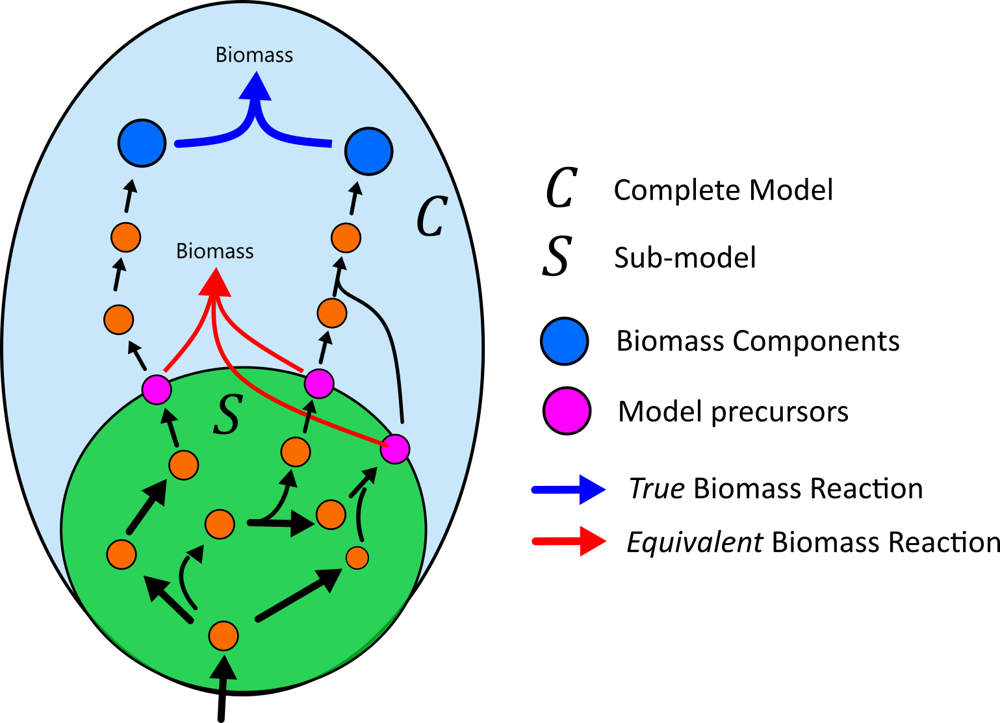

# *i*CH360
<figure>

</figure>
Genome-scale models have emerged as a powerful way to investigate, model, and rewire cellular metabolism. However, depending on the application at hand, large-scale models with thousands of reactions can be cumbersome to work with, and results generated through them can be hard to visualise, inspect, and debug.

## The *i*CH360 metabolic model
*i*CH360 is a medium-scale model of *Escherichia coli* K-12 MG1655 metabolism that focuses core and biosynthetis metabolism. It is well suited whenever a relatively small, highly curated network is desired, when computationally demanding analyses are to be performed, or as an educational tool in the field of metabolic modelling. 
| model   |   reactions |   metabolites |   genes |
|:--------|------------:|--------------:|--------:|
| *i*CH360  |         323 |           304 |     360 |

The model comes with a set of custom [metabolic maps](../Visualisation/) built with the metabolic visualisation tool [Escher](https://escher.github.io/#/) [1], which can be used to visualise the network (or its subsystems) and overlay associated data, including flux distributions, transcriptomics and metabolomics data. In addition, the model is supported by a [knowldge graph](./knowledge_graph.md), which supporting and enhances the use of the stoichiometric model in a range of modelling applications.
## What pathways are included in the model?
*i*CH360 was constructed in a bottom-up fashion by assemblying all the central pathways required by the cell to generate energy and biomass precursors. These pathways were assembled together using the most-recent genome-scale reconstruction, *i*ML1515 [2], as a template, guaranteing consistency with reaction/metabolite identifiers. metabolic subsystems covered by the model include:

| Subsystem                   | Description                                                                 | Metabolic map |
|-----------------            |------------------------------------------------------                       |---------------|
| Carbon uptake and transport | Reactions required for the uptake and assimilation of the following carbon sources: glucose,                        fructose, ribose, xylose, lactate, acetate, gluconate, pyruvate, glycerol, glycerate, succinate, 2-ketoglutarate | [Here](../Visualisation/model_map/full_map.json)             |
| Central carbon metabolism   | Glycolysis, pentose phosphate pathway, pyruvate fermentation, TCA cycle, oxidative phosphorylation                                                                                                           | [Here](../Visualisation/model_map/full_map.json)                  |
| Amino acids biosynthesis    | Biosynthesis of all 20 amino acids from core metabolism precursors                                                                                                                                            | [Here](../Visualisation/pathway_maps/aminoacids_biosynthesis.json)                  |
| Nucleotide biosynthesis     | Biosynthesis of purine and pyrimidine nucleotides (and deoxynucleotides) from core and amino acid metabolism                                                                                                  | [Here](../Visualisation/pathway_maps/nucleotides_biosynthesis.json)                  |
| Fatty-acids biosynthesis    | Biosynthesis of saturated and unsaturated fatty acids present in {\textit{E.~coli}} from acetyl-CoA                                                                                                           | [Here](../Visualisation/pathway_maps/fatty_acids_biosynthesis.json)             |
| C1 metabolism               | One-carbon metabolism                                                                                                                                                                                         | [Here](../Visualisation/pathway_maps/c1_pool.json)             |

On the other hand, the model does *not* include:
- most degradation/recycling pathways.
- the pathways required for the biosynthesis of complex biomass components, such as membrane components.
- the pathways required for *de novo* biosynthesis of cofactors, such NADH, NADPH, and CoA
- transport of metals and ions 
## The *i*CH360 biomass reaction
In metabolic models, the end-product of metabolism are typically channeled into a pseudoreaction known as the "biomass" reaction. This draws away biomass requirements in well-defined ratios, which reflect the biomass composition of the organism of interest. In addition, the stoichiometrix coefficients in this reaction are typically scaled such that the flux through the reaction has unit of $1/h$ and corresponds to the cell's growth rate. Since the metabolic space of *i*CH360 only reaches biomass *building blocks* (such as amino acids, nucleotides, and fatty acids) but not biomass requirements (such phospholipids, peptidoglycans, and others), we equipped the model with an *equivalent* biomass reaction (with ID `Biomass` in the model). In this biomass reaction, complex biomass requirements are converted into equivalent "costs" in terms of metabolic precursors present in the model, which were computed based on manually [curated biosynthesis pathways](../Visualisation/pathways_not_in_model/) for these requirements. This ensures that growth rate predictions obtained through *i*CH360 are directly comparable with those of a genome-scale model.
<figure>

</figure>

## Difference with other small/medium scale models of *E. coli*
the *E. coli* core (ECC) [3] and *E. coli* core 2 (ECC2) [4] models are two other popular small/medium scale models that have been reported in literature. The difference between *i*CH360 and ECC is mostly structural: ECC only covers central carbon metabolism, but does not include biosynthetic pathways. On the other hand, *i*CH360 is closer in size and metabolic coverage with ECC2, there are some differences. First, ECC2 was built with a top-down approach, by algorithmically pruning reaction from a genome-scale model while enforcing protection of certain metabolic phenotypes, while *i*CH360 was assembled in a bottom-up manner. Secondly, the metabolic space of ECC2 spans the production of all compounds consumed in the biomass reaction of its genome-scale parent. In contrast, the metabolic space of*i*CH360 only reaches biomass building blocks and accounts for peripheral pathways only implicitely via its equivalent biomass reaction. Finally, assembly of *i*CH360 was accompanied by an extensive process of update and curation of its annotations to external databases.
## Model variants
Together with the main metabolic model, we provide two model variants:
- EC-*i*CH360 is an enzyme-constrained version of the model, which can be used to predict fluxes and enzyme levels
- *i*CH360red is a reduced version of *i*CH360 (containing 18 less reactions), which is mostly suited for elementary flux mode enumeration and analysis.
--------------
You can find out more about the model and its variants in our [pre-print](https://arxiv.org/abs/2406.16596).
## References
1. King, Z. A. et al. Escher: A Web Application for Building, Sharing, and Embedding Data-Rich Visualizations of Biological Pathways. PLOS Computational Biology 11, e1004321 (2015).
2. Monk, J. M. et al. iML1515, a knowledgebase that computes Escherichia coli traits. Nat Biotechnol 35, 904–908 (2017).
3. Orth, J. D., Fleming, R. M. T. & Palsson, B. Ø. Reconstruction and Use of Microbial Metabolic Networks: the Core Escherichia coli Metabolic Model as an Educational Guide. EcoSal Plus 4, 10.1128/ecosalplus.10.2.1 (2010).
4. Hädicke, O. & Klamt, S. EColiCore2: a reference network model of the central metabolism of Escherichia coli and relationships to its genome-scale parent model. Sci Rep 7, 39647 (2017).
