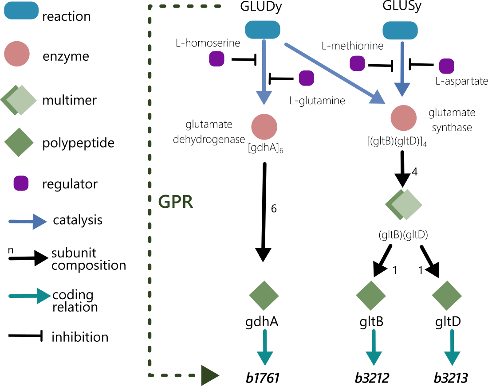
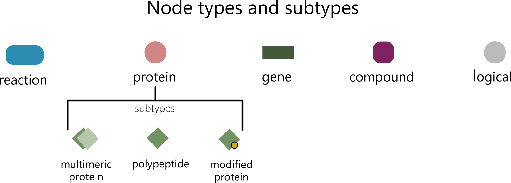
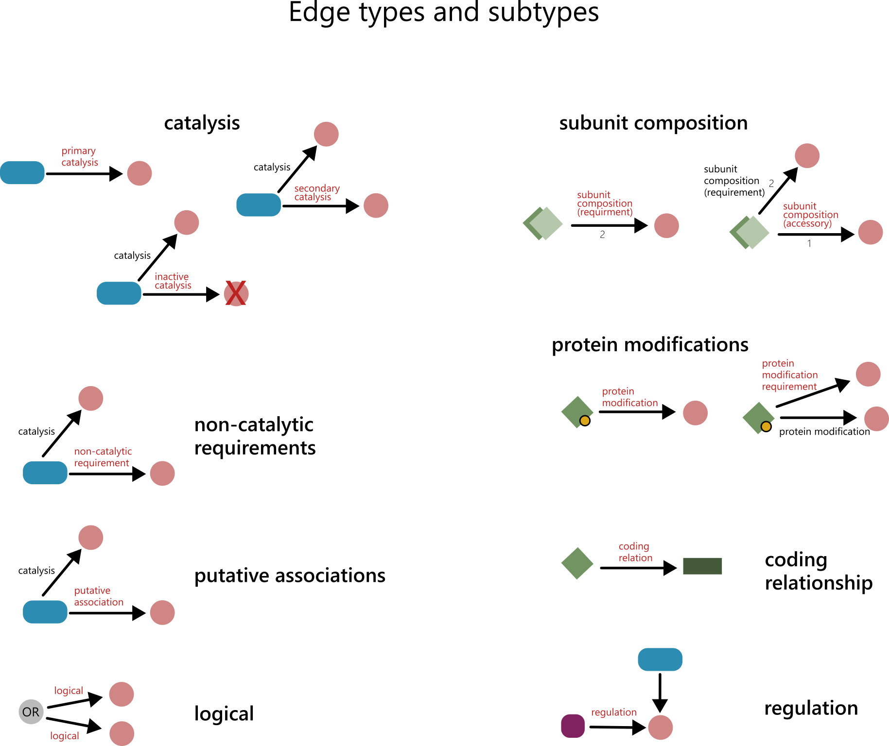

# The *i*CH360 knowledge graph
## Mapping reactions to genes
COBRA metabolic models, such as *i*CH360, describe metabolic networks in terms of reactions, metabolites, and genes. Typically, metabolic reactions are mapped to genes via gene-protein-reaction (GPR) rules. These are boolean rules, indicating which combination(s) of genes must be present for a reaction to operate. For example, the GPR:
```
(gene_3) or (gene_1 and gene_2)
```
indicate that either `gene_3` or both `gene_1` and `gene_2` must be present for this reaction to be active. While this type of mapping is sufficient for *in silico* knockout studies or optimal knockout design algorithms (e.g. Optknock), it does not explicitely capture the intermediate biological entities that link a reaction to a given set of genes, such as enzymes and their protein components. In addition, a reaction may have both catalytic (enzymes) and non-catalytic (e.g. protein cofactors, proteins required for post-translational modifications, etc.) requirements. These differences are not captured by simple boolean GPR rules and may occasionally be important to resolve (for example, when constructing an enzyme-constrained metabolic model).
## What is the *i*CH360 knowledge graph?
The *i*CH360 knowledge graph is a data structure that supports and enhances the *i*CH360 COBRA model by providing an explicit characterisation of all biological entities involved in the link between reactions and genes in the model.
<figure>

</figure>

The graph was assembled based on data retrieved from the EcoCyc database, which was then manually curated and annotated. In the graph, nodes represent biological entities (reactions, proteins, genes, compounds) and edges denote (potentially quantitative) relationships between them. For example, a reaction may be connected to a protein by a *catalysis* edge, indicating that the protein is an enzyme for that reaction. Similarly, a protein may be connected to another protein by a *subunit composition* relationship, implying that the latter protein is a subunit of the former. All this information is provided in a structured, computationally-accessible form, which makes it easier to integrate the knowledge graph into metabolic modelling modelling pipelines
## Nodes and their types
At the core of the graph lay nodes, which represent biological entities relevant to the model. Each node is identified by a unique identifier and is assigned a defined type. Depending on their type, nodes can be further equipped with additional attributes, which may include subtypes, annotations to external databases, molecular weights, and other.
<figure>

</figure>

### Reaction nodes
Nodes of type `reaction` represent chemical or biochemical reactions in the model and their ID (e.g. `bigg:DHORTS`) maps directly to the BIGG identifiers of the reactions in the COBRA model. As such, they are the the primary links connecting the metabolic model and the knowledge graph.
### Protein nodes
Nodes of type `protein` represent biological proteins and are uniquely mapped with the EcoCyc database. All protein nodes are annotated with a molecular weight (in kDa), which was computed recursively based on known polypeptide weights. Protein nodes are further catalogued into subtypes, namely
- **polypeptides** (`polypeptide`) represent individual protein chains and are directly linked to genes. 
- **multimeric proteins** (`multimeric_protein`) represent protein complexes (quaternary structures) formed by distinct subunits.
- **modified proteins** (`modified_protein`) represent proteins (including complexes) that have undergone some form of post-translational modification (e.g. phosphorilation, activation, etc.)
### Gene nodes
Nodes of type `gene` represent *E. coli* coding genes (each coding for a polypeptide) are are identified by their b-number (enabling mapping to the COBRA model). They are further annotated with the gene name and other relevant references to genomic databases.  
### Compound nodes
Nodes of type `compound` represent small molecules, and are mainly included in the graph to capture small-molecule regulation (involvement of metabolites in the reactions is not captured in the graph to avoid redundance with the stoichiometric model). When available, they are annotated with a BIGG ID, enabling mapping with the COBRA model.
### Logical nodes
Nodes of type `logical_OR`/`logical_AND` are different from the previous ones in that they don't represent biological entities. Their role in the graph is to enable the expression of arbitrary complex logic rules when generating GPRs (for example, enabling a protein *OR* another to be part of a larger complex).

## Edges and their types
<figure>

</figure>

All nodes in the graph are connected to each other via a set of relationships, which are usually referred to as *edges* in the graph analysis literature. Particularly, the graph is a *directed* graph, meaning that these relationship have a defined directionality from a *parent* node to a *child* node. Similarly to nodes, every edge in the graph has a well defined type, and some edges have additional attributes, such as a subtype, a weight, notes, or references to relevant literature.
### Catalytic edges
Edges of type `catalysis` always go from `reaction` to `protein` nodes and are used to denote that the child protein is an enzyme for the parent reaction. catalytic nodes are further annotated with a subtype, distinguishing between:
- **primary catalysis** (`primary`): these are the default catalytic relationships in the graph.
- **secondary catalysis** (`secondary`): denote that the enzyme had been shown in literature (based on *in vitro* or *in vivo* evidence) to account for only minor catalytic activity for the reaction when compared to another (primary) isoenzyme. Notes and references to the relevant literature are included as edge attributes.
- **inactive catalysis** (`inactive`) these are used to link reactions with known enzymes which are however inactive in the K-12 strain modelled by *i*CH360 (but may be active in other *E coli* strains). 
### Subunit composition edges
Edges of type `subunit_composition` always go from `protein` (specifically, `multimeric_protein` subtypes)  to `protein` nodes and are used to represent composition of protein complexes. These edge types are assigned a weight, corresponding to the stoichiometry of the composition relationship. In addition, they are assigned a subtype, distinguishing between:
- **required components** (`requirement`), if the subunit is required for correct folding/function of the complex
- **accessory components** (`accessory`) if the subunit is not strictly required for function of the complex.
### Protein modification edges
These edges are used to represent post-translational modification relationships and go from `protein` (specifically, `modified_protein`) to `protein` nodes. Particularly, edges of type `protein_modification` denote that the parent protein is a modified version of the child protein, while edges of type `protein_modification_requirement` indicate that the child protein is required to to achieve the modification leading to the parent protein.
### Non-catalytic requirements
Edges of type `non_catalytic_requirement` always go from `reaction` to `protein` nodes and are used to indicate that the child protein is required by the parent reaction to work, but not as a catalyst. Common examples include proteins partecipating in the reaction as cofactors (e.g. glutaredoxins, thioredoxins) or prosthetic groups (e.g. acyl-carrier proteins).
### Coding Relationships
Edges of type `coding_relation` are used to connect polypeptides with their coding genes.
### Regulation edges
Edges of type `regulation` always go from `compounds` or `protein` nodes to  `protein` nodes, and denote that the parent node is a regulator for the child enzyme. Additional node attributes include the regulated reaction and, if avaliable, the regulation type (activation/inhibition) and mechanism (allosteric, competitive). If available, these edges are also given a weight, corresponding to quantitative activation/inhibition constants.
### Putative association edges
Edges of type `putative_association` are used to represent association of various types between nodes, which are however only putative. Notes and reference to the association are provided as edge attributes.
### Logical edges
Edgs of type `logical` are different from the others in that they don't match physical relationships. They always connect logical nodes with other nodes, and are used to create arbitrary complex logic rules in the graphs.

## Computation of GPR rules
A major advantage the use of this graph structure is that the boolean GPR rule for each reaction or protein node depends solely on the GPR rules of its children nodes. Hence, the GPR rule for *any* reaction/protein node can be computed via a simple, recursive algorithm. Particularly, the GPRs in the *i*CH360 COBRA model were obtained via the following rules. Given a node in the graph:

- If the node is a `logical_OR` (`logical_AND`) node, its GPR is the OR (AND) of the GPRs of its children nodes.
- If the node is a `protein` node:
    - If the node is a `polypeptide`, its GPR expression is, trivially, the gene associated to the node.
    - If the node is a `multimeric_protein`, its GPR is computed as the *AND* of the GPR expressions of the children nodes connected to it by a `subunit_composition` edge (excluding `accessory` composition relationships)
    - If the node is a `modified_protein`, its GPR is computed as the *AND* of the children nodes connected to it by either a `protein_modification` or `protein_modification_requirement` edge.
- If the node is a reaction, its GPR is first constructed as the *OR* of the GPRs of its catalytic children. These are all nodes connected to it via a `catalyis` edge, excluding `inactive` subtypes. Depending on the application at hand,excluding  `secondary` catalysis edges may also be desirable. To account for non-catalytic protein requirements of the reaction, this expression is then *AND*ed with the GPR expressions of all non-catalytic children (nodes connected to it via a `non_catalytic_requirement` edge).
