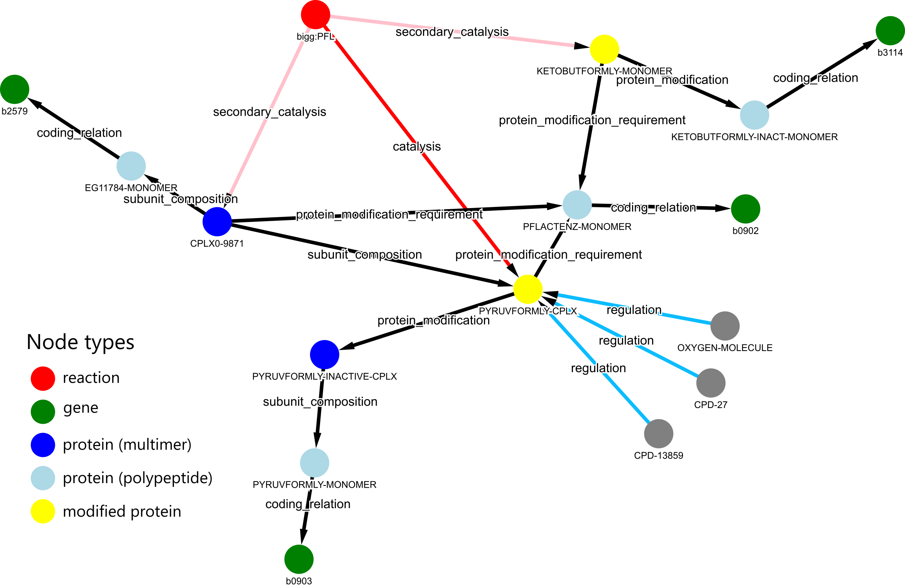

## *i*CH360 Knowledge Graph
In this folder, you can find the *i*CH360 knowledge graph, a useful tool complementing the information present in the stoichiometric model with ready-to-access, structured biological knowledge mapped to the model.  The graph was assembled using information retrieved from the EcoCyc database and by manual curation. In the graph, nodes represent biological entities (reactions, proteins, genes or compounds) and edges represent (potentially quantitative) functional relationships between them, including catalysis, protein subunit composition, protein modification, and regulatory interactions.

The graph is provided in GML (.gml) and Cytoscape (.cyjs) formats, both of which can be read by various graph-handling packages. A popular example is NetworkX [1], which is the one we use to load, manipulate, and investigate the graph in the relevant example notebook.

As an example, here is the biological knowledge encoded by the graph for the Pyruvate Formate Lyase (PFL) reaction, visualised with the gravis package (https://robert-haas.github.io/gravis-docs/).

